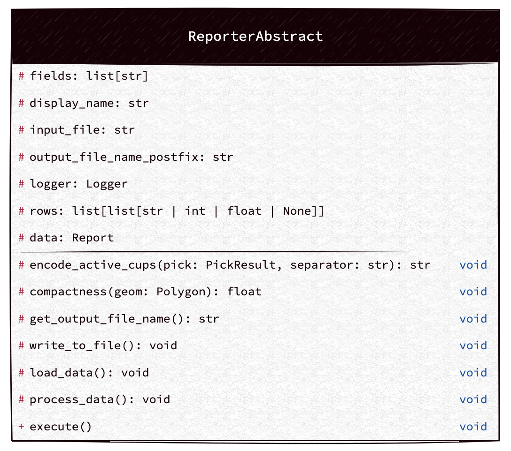

# Reporter Lib


## Technical Overview

- **Asynchronous IO**  
  - Non-blocking I/O to load data from the input file and write data to the CSV file.  
  - **Benefit**: Efficient resource usage and faster processing.

- **Poetry for Dependency Management**  
  - Poetry is used for managing dependencies and packaging.  
  - **Benefit**: Simplifies dependency management and ensures reproducible builds.

- **Using Ruff (linter, formatter, and sorting imports), Strict typing, Bandit**  
  - Fastest linters and best use of mypy (strict) for code quality.  
  - **Benefit**: Improves code maintainability and readability.

- **GitHub Actions**  
  - Continuous integration for automatic linting, testing, and deployment.  
  - **Benefit**: Ensures consistency, code quality, and fast feedback during development.

- **Dockerization**  
  - Containerized environment for running the application.  
  - **Benefit**: Simplifies deployment and ensures consistency across different environments.

- **Domain-Driven Approach**  
  - Adding a new CSV reporter type is as simple as defining a class in the `csv_reporter` module, and it will work seamlessly.  
  - Adding a new reporter type (e.g., PDF) is as simple as modifying the argument parser.  
  - **Benefit**: Makes the system extensible and scalable.

## Maintainability Improvements

- **ETL Data Process**  
  - Follows a structured ETL approach: Extract, Transform, Load.  
  - **Benefit**: Clear separation of concerns for maintainability and easier debugging.

- **Removing Infinite Loops & Adding Argument Parser**  
  - Refactored code to remove infinite loops and introduce an argument parser to make the code more extensible.  
  - **Benefit**: Improves control flow and provides easier configuration for different use cases.

- **Data Validation with Pydantic**  
  - Integrated data validation using Pydantic models to ensure data integrity.  
  - **Benefit**: Ensures accurate and consistent data processing.

- **Improved Type Hinting (Strict Mode)**  
  - Stricter typing is enforced, ensuring better code quality and fewer bugs.  
  - **Benefit**: Increases maintainability and reduces the risk of runtime errors.

- **Code Linters and Formatters**  
  - Added code linters and formatters to enhance readability and consistency across the codebase.  
  - **Benefit**: Improves code quality and makes it easier to maintain.

- **Unit Tests**  
  - Added unit tests to ensure that the code works as expected and to catch regressions.  
  - **Benefit**: Increases the trustworthiness of the code and helps with maintenance.

- **Code Documentation**  
  - Added detailed docstrings and comments to the code for better readability and understanding.  
  - **Benefit**: Enhances maintainability and helps new developers get up to speed quickly.

- **Improved Logging**  
  - Integrated proper loggers to track and debug issues effectively.  
  - **Benefit**: Makes the application more maintainable by providing insight into its behavior during runtime.

## Known Limitations

- **Data Validation**  
  - Some validations still contain a lot of default values, which is not ideal. Usually, we prefer to ignore corrupted data rather than assigning default values. This issue was assumed to be intentional, so it was left unchanged. However, I did enhance some fields to ensure we won’t encounter `AttributeError` in the future.

- **Data Integrity**  
  - While we strive for high data quality, there may still be cases where some fields or values are not validated as strictly as they should be. Further improvements to validation can help reduce the risk of processing corrupt or invalid data.


## UML Class Diagram (main)



### Tool Specifications

`airborne-reporter [-h] [-p] <input_file> <export_type> `

|     Field     |  Type   |                       Description                       |
|:-------------:|:-------:|:-------------------------------------------------------:|
| `input_file`  | String  | path to json input file (ex: tests/resources/test.json) |
| `export_type` | String  |         Export Type names (see choices in help)         |
|     `-p`      |  bool   |           Eun the project on production mode            |
|     `-h`      |  void   |                          help                           |


## How to run the tool (for developers)?

- Prepare environment (ignore if you already have it installed)
  
  - running on docker (recommended)
    - Install docker [(click)](https://docs.docker.com/engine/install/)
  - running on your own machine
    - Install poetry [(click)](https://python-poetry.org/docs/#installing-with-the-official-installer)
    - Install Makefile (optional)


- Clone the project
```bash
  git clone git@github.com:alirezakhosraviyan/reporter-lib.git
```

```bash
  cd reporter-lib
```
- Run the project using Docker (recommended)
```bash

  # Get a shell to the docker container
  docker build -t reporter-lib:dev --target development . && docker run --rm -it -v ./input:/home/app/input -v ./output:/home/app/output reporter-lib:dev /bin/sh
  
  # Run the report
  poetry run airborne-reporter tests/resources/test.json CSVAttentionPliesFormatter
  
  # Check output csv file
  cd output
  ls
  
  # for more information
  poetry run airborne-reporter --help
```

If you run the project with docker, it will create an input and output folder in the current directory (on your own machine), so you can put your input files there and also check report csv files in output folder.

- on your own machine:
```bash
  
  # Install dependencies
  poetry install
  
  # Run the report
  poetry run airborne-reporter tests/resources/test.json CSVAttentionPliesFormatter
  
  # Check output csv file
  cd output
  ls
  
  # for more information
  poetry run airborne-reporter --help
```

### (optional) Running the tool using make file for development
```bash
  
  # Install dependencies
  make shell
  
  # Run linters, formatter, mypy, test
  make check
  
```

### How to build for production (for future)?
for production, you can build the package using poetry or docker and push it to a package repository and the you can install it using pip like
`pip install reporter-lib`
