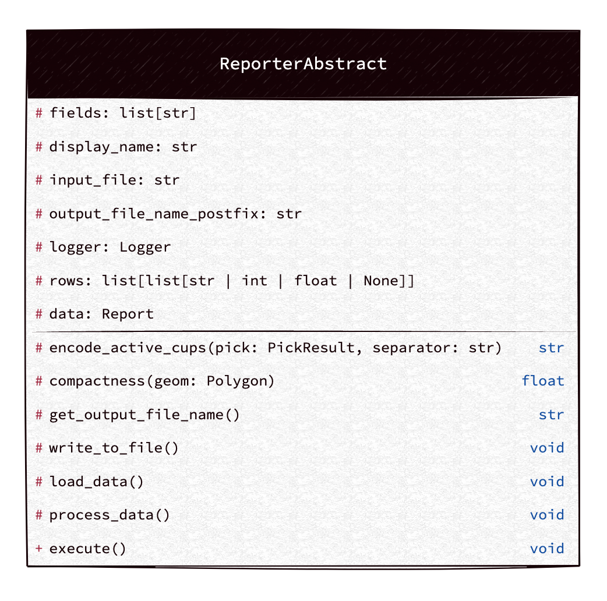

# Reporter Lib

The command line tool which asynchronously consumes messages from a server and processes them using an ETL approach.

### Technical Overview

- Asynchronous IO 
  - non-blocking I/O to load data from input file and write data in csv file
  - **`Benefit`** : Efficient resource usage and faster processing.

- Poetry for Dependency Management
  - Poetry for managing dependencies and packaging.
  - **`Benefit`**: Simplifies dependency management and ensures reproducible builds.

- Using Ruff (linter, formatter and sorting imports), Strict typing, Bandit
  - Using the fastest linters and best use of mypy (strict)
  - **`Benefit`**: Makes the code more maintainable

### Maintainability Improvements

- ETL Data Process
  - Follows a structured ETL approach: Extract, Transform, Load.
  - **`Benefit`**: Clear separation of concerns for maintainability.

### Known limitations
- improving data 


## UML Class Diagram (main)



### Tool Specifications

`airborne-reporter [-h] [-p] <input_file> <export_type> `

|     Field     |  Type   |                       Description                       |
|:-------------:|:-------:|:-------------------------------------------------------:|
| `input_file`  | String  | path to json input file (ex: tests/resources/test.json) |
| `export_type` | String  |         Export Type names (see choices in help)         |
|     `-p`      |  bool   |           Eun the project on production mode            |
|     `-h`      |  void   |                          help                           |


## How to run the tool (for developers)?

- Prepare environment (ignore if you already have it installed)
  
  - running on docker (recommended)
    - Install docker [(click)](https://docs.docker.com/engine/install/)
  - running on your own machine
    - Install poetry [(click)](https://python-poetry.org/docs/#installing-with-the-official-installer)
    - Install Makefile (optional)


- Clone the project
```bash
  git clone git@github.com:alirezakhosraviyan/reporter-lib.git
```

```bash
  cd reporter-lib
```
- Run the project using Docker (recommended)
```bash

  # Get a shell to the docker container
  docker build -t reporter-lib:dev --target development . && docker run --rm -it -v ./input:/home/app/input -v ./output:/home/app/output reporter-lib:dev /bin/sh
  
  # Run the report
  poetry run airborne-reporter tests/resources/test.json CSVAttentionPliesFormatter
  
  # Check output csv file
  cd output
  ls
  
  # for more information
  poetry run airborne-reporter --help
```

if you run the project with docker, it will create an input and output folder in the current directory (on your own machine), so you can put your input files there and also check report csv files in output folder.

- on your own machine:
```bash
  
  # Install dependencies
  poetry install
  
  # Run the report
  poetry run airborne-reporter tests/resources/test.json CSVAttentionPliesFormatter
  
  # Check output csv file
  cd output
  ls
  
  # for more information
  poetry run airborne-reporter --help
```

### (optional) Running the tool using make file for development
```bash
  
  # Install dependencies
  make shell
  
  # Run linters, formatter, mypy, test
  make check
  
```

### How to build for production (for future)?
for production, you can build the package using poetry or docker and push it to a package repository and the you can install it using pip like
`pip install reporter-lib`
